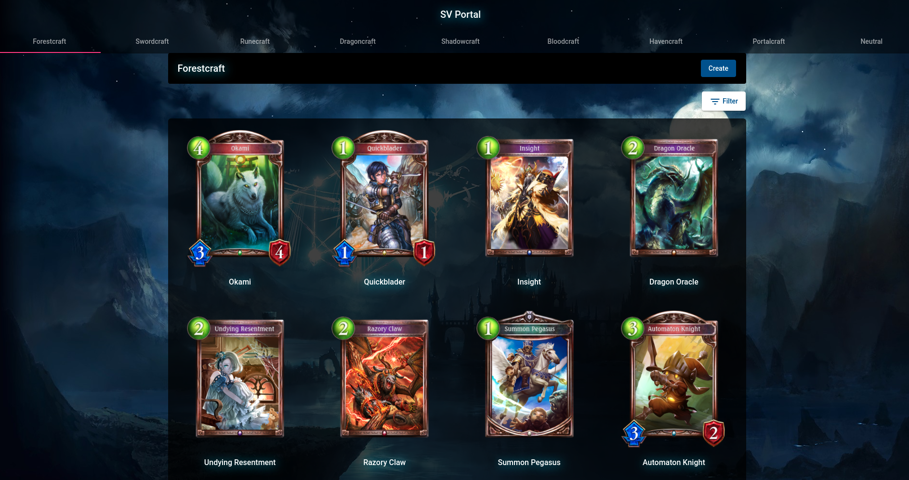

# SV Portal

    
    

My own implementation/design of the [Shadowverse Portal](https://shadowverse-portal.com/?lang=en) website.

## Prerequisites

1. [Node.js](https://nodejs.org/en/)
2. [.NET Core](https://dotnet.microsoft.com/en-us/download)
3. [PostgreSQL](https://www.postgresql.org/download/)
4. [Docker](https://docs.docker.com/get-docker/) (optional)

## How to setup backend

Follow the [README](SV.Edge/README.md) in `SV.Edge` folder

## How to setup frontend

Follow the [README](SV.Web/README.md) in `SV.Web` folder
