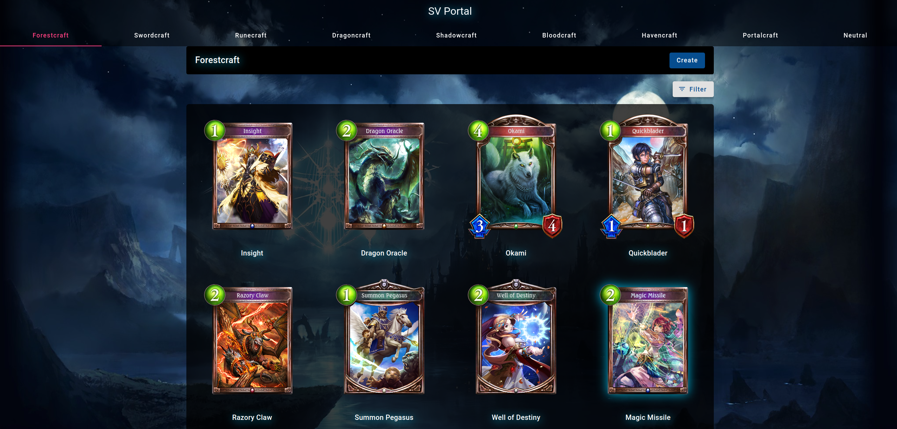
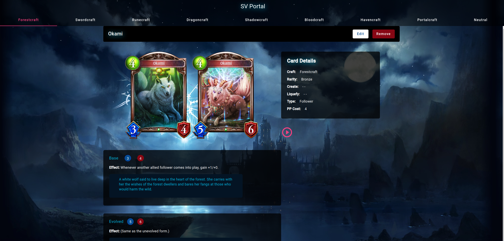

# SV Portal

    
    

My personal implementation and design inspired by the [Shadowverse Portal](https://shadowverse-portal.com/?lang=en) website.

## Backend Setup

To set up the backend of SV Portal, follow the instructions provided in the SV.Edge [README](SV.Edge/README.md) located in the `SV.Edge` folder.

## Frontend Setup

For the frontend setup, refer to the SV.Web [README](SV.Web/README.md) in the `SV.Web` folder.
